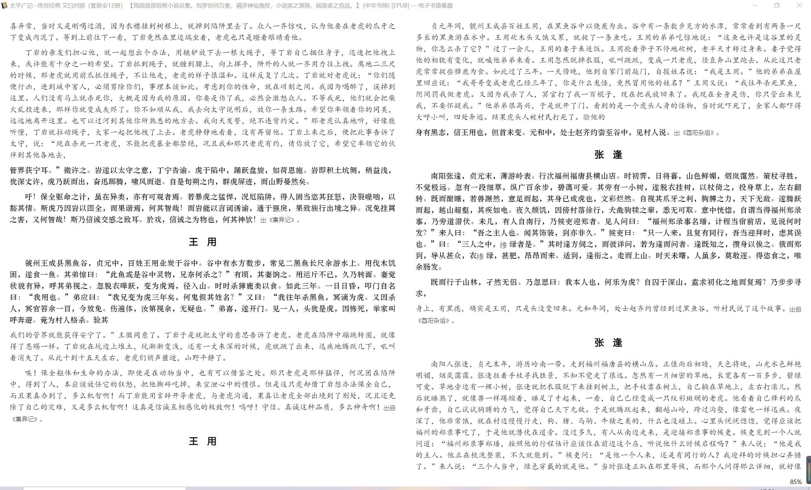

# 段落对齐实验

本次对文心雕龙、资治通鉴、太平广记三本书进行段落对齐

段落对齐的结果在文件夹下的三个zip包中，其中``i_src.txt``为古文的段落，``i_tgt.txt``为现代文对应的段落，i为对应的编号

下面简述对三个文本的操作过程

## 文心雕龙

文心雕龙的操作过程比较简单，因为本身文本已经做好了段落对齐工作

实现流程如下，见preprocess_0.py文件
+ 使用``calibre``软件将本书从epub格式转换为txt格式，并去除非正文部分
+ 读取txt文件，正则匹配文本，匹配到``..第.``的格式时读取到了古文，匹配到``【译文】``的格式时读取到了现代文
+ 在匹配成功后，接下来的一行文本即为古文/现代文对应的文本，使用cut_sent(使用正则匹配的中文分句方法)进行分句，添加到list中
+ 按照顺序，把原文和译文对齐的段落写入到文件中

## 资治通鉴

资治通鉴段落对齐的依据为每一段落开头的年份，且原文译文一段一段

实现流程如下，见preprocess_1.py文件
+ 使用解压缩软件直接解压epub格式的文件，去除掉非正文部分的html文件
+ 注意到文件中每一行满足``
.*
``，按行遍历文件，按照这种方式提取包含文字的行
+ 对于包含正文内容的行，存在年份标识的话读取其中的年份数字，然后作为段落对齐的标识
+ 注意到原文和译文的年份标识是交替出现的，所以交替标注这个年份对应的是原文还是译文
+ 将该年份后的所有的正文提取并使用cut_sent分句后作为list的一项存储在原文/译文对应list中
+ 按照顺序，把原文和译文中对齐的段落写入到文件中

## 太平广记

太平广记是最难处理的文本，主要的处理依据是原文和译文的字体格式不同，通过这种不同区分原文和译文

段落对齐的标识是每个段落的标题，对应有特别的标题格式，且原文和译文不同

这里遇到了以下问题
+ 译文的标题有两种格式，一种单行，一种跨行且标题的格式略有不同。
    + 解决方法：根据初步提取原文和译文的标题进行比较找到译文的两种格式
+ 正文部分也存在跨行的情况。
    + 解决方法：读取到正文时，不断读取下一行直到读取到了html的结束标识
+ 如下图，存在原文标题下的内容既有这个标题的原文和上个标题的剩余译文，译文标题下的内容既有这个标题的译文也有下个标题的原文的情况。
    + 解决方法：根据原文和译文分开提取，根据标题进行划分

实现流程如下，见preprocess_2.py:
+ 使用解压缩软件直接解压epub格式的文件，去除掉非正文部分的html文件
+ 对于每个文件，确定正文的正则匹配格式和标题的正则匹配格式
+ 按行遍历文件，使用正则匹配的方式提取每一行中的中文句子
+ 标题匹配成功后，分别提取原文的标题和译文的标题，读取到新的标题后将上个标题字符串用cut_sent分句后存入到原文/译文对应的list中
+ 正文匹配成功后，将对应的原文/译文的正文直接添加到对应的字符串后
+ 按行遍历完文件，把剩余的原文/译文正文字符串用cut_sent分句后存入到对应的list
+ 按照顺序，把原文和译文中对齐的段落写入到文件中