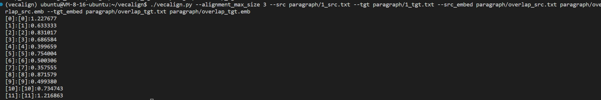
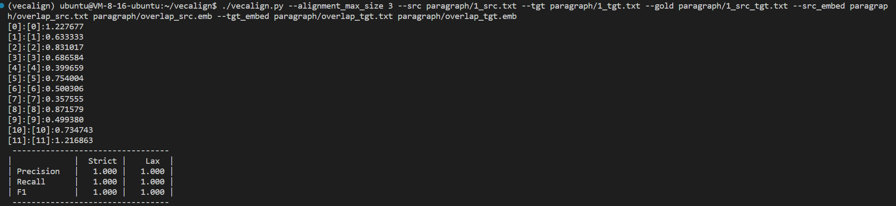

# Vecalign 调研报告 

本次调研的开源工具：https://github.com/thompsonb/vecalign

## 算法

vecalign使用laser将文本转换为词向量，根据词向量度量句子的相似度

$$c(x, y) = \frac{(1-cos(x, y)nSents(x)nSents(y))}{\sum_{s=1}^S 1 - cos(x, y_s) + \sum_{s=1}^S 1 - cos(x_s, y)}$$

根据这个计算公式，使用动态规划方式找到相似度最大的句子对齐方式，需要注意的是对于非1-1对齐方式采取了一定惩罚

## 测试流程

### 文本重叠处理

根据之前对于《文心雕龙》的处理过程，共有321个段落，对应与i_src.txt（古文） 和 i_tgt.txt（现代文），i为索引

句子对齐前需要先使用vecalign中的overlap.py对双语文本进行重叠处理，设置overlap参数指定重叠的数量。  
重叠的方式是遍历每个文件，对于第i行，将从第i行开始的一行、两行直到overlap行句子合并作为新的句子写入文本。

overlap的设置一般为可能对齐方式中x-y中x+y的最大值。根据初步观察和对双语文本句子数量的统计，绝大部分的对齐方式是1-1，混杂少量1-2，2-1方式。基于此设置overlap=3

```python
python overlap.py -i paragraph/*tgt.txt -o paragraph/overlap_tgt.txt -n 3
python overlap.py -i paragraph/*src.txt -o paragraph/overlap_src.txt -n 3
```

部分结果如下：
```
一朝综文，千年凝锦
一朝综文，千年凝锦 余采徘徊，遗风籍甚
一朝综文，千年凝锦 余采徘徊，遗风籍甚 无曰纷杂，皎然可品
万古声荐，千里应拔
万古声荐，千里应拔 庶务纷纶，因书乃察
三代所兴，询及刍荛
三代所兴，询及刍荛 《春秋》释宋，鲁僖预议
三代所兴，询及刍荛 《春秋》释宋，鲁僖预议 及赵灵胡服，而季父争论；商鞅变法，而甘龙交辨
三代政暇，文翰颇疏
三代政暇，文翰颇疏 春秋聘繁，书介弥盛
三代政暇，文翰颇疏 春秋聘繁，书介弥盛 绕朝赠士会以策，子家与赵宣以书，巫臣之责子反，子产之谏范宣，详观四书，辞若对面
三代玉瑞，汉世金竹
三代玉瑞，汉世金竹 末代从省，易以书翰矣
三极彝训，其书曰“经”
三极彝训，其书曰“经” “经”也者，恒久之至道，不刊之鸿教也
三极彝训，其书曰“经” “经”也者，恒久之至道，不刊之鸿教也 故象天地，效鬼神，参物序，制人纪，洞性灵之奥区，极文章之骨髓者也
```

### 文本embed

使用facebook开源的laser对生成两个overlap的文本进行embedding

laser的开源地址：https://github.com/facebookresearch/LASER

使用方法：
+ git clone到本地
+ 参照README中的Dependencies使用``pip install``下载需要的python库（建议使用创建一个虚拟环境）
+ 参照README中的Installation安装LASER，这里注意第二步``bash ./nllb/download_models.sh``是不需要
+ 可能需要自行下载安装FastBPE

之后使用以下命令，进行embedding
```bash
tasks/embed/embed.sh ~/vecalign/paragraph/overlap_src.txt ~/vecalign/paragraph/overlap_src.emb
tasks/embed/embed.sh ~/vecalign/paragraph/overlap_tgt.txt ~/vecalign/paragraph/overlap_tgt.emb
```

### 句子对齐 

最后使用以下命令进行句子对齐，注意需要根据README安装需要的python库

```bash
./vecalign.py --alignment_max_size 3 --src paragraph/1_src.txt --tgt paragraph/1_tgt.txt --src_embed paragraph/overlap_src.txt paragraph/overlap_src.emb --tgt_embed paragraph/overlap_tgt.txt paragraph/overlap_tgt.emb  > result
```

对应的结果会按照顺序显示对齐方式x-y和对应的cost


如果需要打分，可以使用-g选项接真正的对齐结果，文件和上面的格式一样，这里简单展示，直接使用没有cost的result结果作为gold标准

```bash
./vecalign.py --alignment_max_size 3 --src paragraph/1_src.txt --tgt paragraph/1_tgt.txt --gold paragraph/1_src_tgt.txt --src_embed paragraph/overlap_src.txt paragraph/overlap_src.emb --tgt_embed paragraph/overlap_tgt.txt paragraph/overlap_tgt.emb  
```



